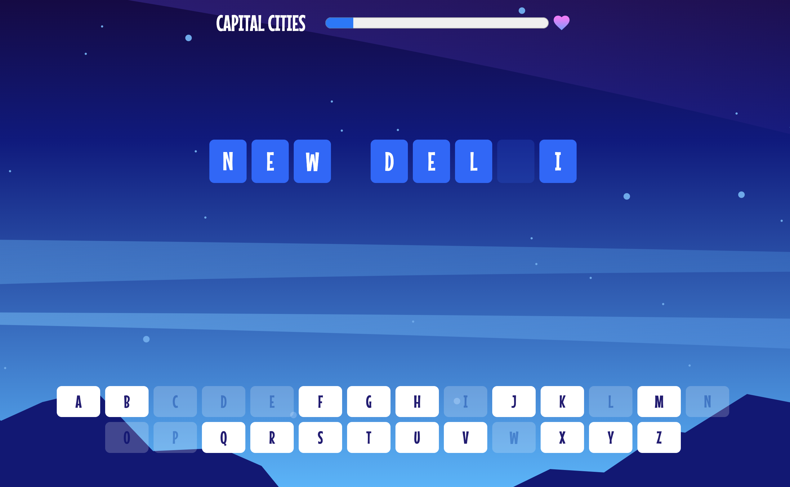
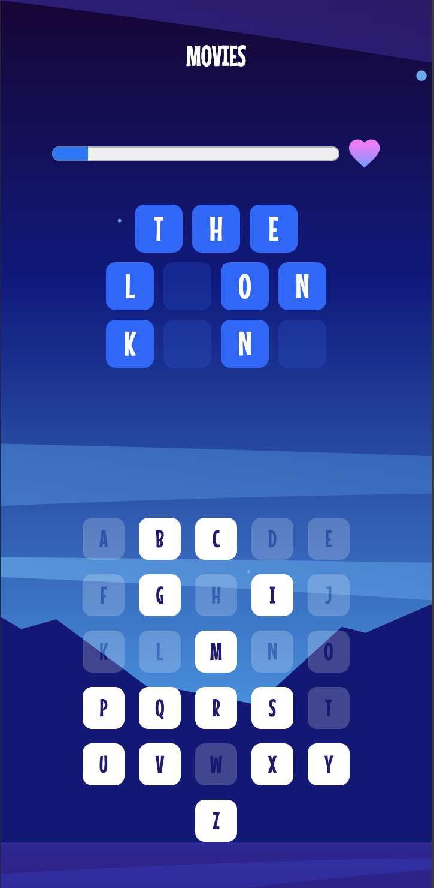

# Frontend Mentor - Hangman game solution

This is a solution to the [Hangman game challenge on Frontend Mentor](https://www.frontendmentor.io/challenges/hangman-game-rsQiSVLGWn).

## Table of contents

- [Overview](#overview)
  - [The challenge](#the-challenge)
- [My process](#my-process)
  - [Built with](#built-with)
  - [What I learned](#what-i-learned)

## Overview

### The challenge

Users should be able to:

- Start a game and choose a category.
- Play Hangman with a random word selected from that category.
- See their current health decrease based on incorrect letter guesses.
- Win the game if they complete the whole word.
- Lose the game if they make eight wrong guesses.
- View the optimal layout for the interface depending on their device's screen size.
- See hover and focus states for all interactive elements on the page.
- Navigate the entire game only using their keyboard.

## My process




### Built with

- Semantic HTML5 markup
- CSS custom properties
- Flexbox
- CSS Grid
- Mobile-first workflow

### What I learned

Within this project I was able to learn about using data from a JSON file based on a specific user selection. I learned how to give the user the ability to play the game using keyboard inputs. Learning an efficient way of iterating over the solution everytime a user made a guess was the most challenging part of this task. This included using loops to check if the letter had been guessed before, if the target word contained the guessed letter (whilst also accounting for repeat letters in the solution) and finally checking if the solution had been reached.

I enjoyed learning how to manipulate the dialog element including it's various states and at various screen sizes.

```css
dialog[open] {
  display: flex;
  flex-direction: column;
  justify-content: space-between;
  align-items: center;
  font-size: 24px;
  gap: 1rem;
  border-radius: 8px;
  background-color: #261676;
  color: white;
  border: 1px solid black;
}

dialog[open] button {
  width: 11rem;
  height: 3rem;
  border-radius: 8px;
  color: white;
  background-color: #2463ff;
  border: none;
  font-family: "Mouse Memoirs";
  font-size: 22px;
}

dialog[open] button:hover {
  background-color: #082b82;
}
dialog[open] button:active {
  background-color: #041644;
}
```

I am pleased with this code snippet for generating a random item from the category the user selected

```js
function selectRandomItem(category) {
  const categoryIndex = Math.floor(Math.random() * category.length);
  const randomName = category[categoryIndex].name;
  targetWord = randomName.toUpperCase().split(" ");
  modifiedTargetWord = randomName.toUpperCase().split(" ").join("");
}
```
